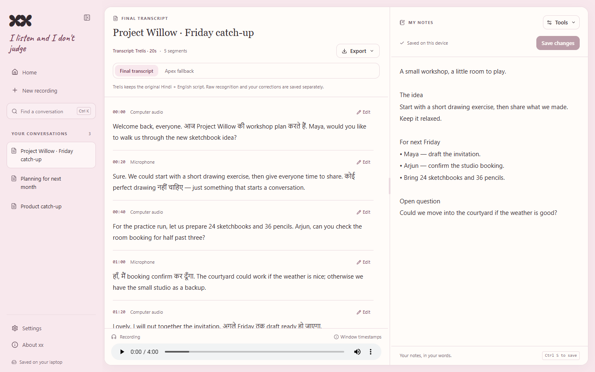

# xx

**I listen and I don't judge**

Hinglish Transcription Platform is a local Windows desktop app for recording calls, keeping the audio, and working with Hindi–English transcripts. It builds on Meetily Community with a local inference worker and a transcript-first workspace.

*The screenshot uses fictional conversations, names, and quantities.*

## What it does

- Records microphone and system audio into separate local tracks, with a recovery journal written before transcription.
- Runs **Trelis · 20 seconds · OpenVINO GPU FP16** during the call, preserving its original Hindi/English script. The same job finishes any remaining saved audio after you stop; there is no second full transcription pass.
- Offers **Apex · 20 seconds** as an explicit fallback. Trelis pauses after its current window, then Apex replays the saved audio into a separate Roman Hinglish version.
- Retains raw output, separate corrections, and history. “Final transcript” means the Trelis job completed; it remains unreviewed machine output until you check it.
- Keeps recordings, transcripts, notes, speaker review, and playback together.
- Runs optional Community-1 speaker identification locally after recording and transcription complete.
- Lets you copy a corrected transcript into Claude or export a text attachment. You choose when to send it. There is no Qwen summary model or automatic Claude/API upload.
- Includes an optional evidence-backed project Vault for verified names, terms, and quantities. Vault entries do not silently rewrite what a model heard.

## Get started

Read **[Windows setup](docs/SETUP.md)** for the existing installation and developer setup path. **[How it works](docs/HOW_IT_WORKS.md)** explains capture, models, revisions, retries, and storage. **[Privacy](PRIVACY_POLICY.md)** describes local processing and manual export.

The everyday flow is **record + Trelis live transcript → stop → finish remaining audio → review/export**. Updates use 20-second windows **plus processing and queueing time**, and GPU startup adds initial delay. One heavy worker runs at a time, so back-to-back calls can queue; recording continues independently. A GPU failure is shown explicitly, without silently switching Trelis to CPU. Choose Apex fallback or retry when ready. Existing transcript versions, including older Apex-draft/Trelis-final calls, keep their original workflow and corrections.

The integrated GPU adapter reproduced **23/23 CPU chunk outputs over 400.15 seconds** of development audio. The earlier acceleration experiment measured **8.14× faster** processing on a matched warm subset. A five-minute replay through the actual worker completed **30/30 windows across two saved-audio streams**, preserving raw output and finishing about **16 seconds after input stopped**. It **missed the strict latency gate**: first text took about 50 seconds; the 95th-percentile delay was about 30 seconds after a window ended. These results came from an Intel Ultra 7 268V / Arc 140V laptop. They do not qualify physical capture, a concurrent calling application, or 90-minute performance. See [timing and validation details](docs/HOW_IT_WORKS.md#models-and-timing).

This is an early Windows implementation. The installer currently reuses model files and isolated Python environments already prepared on the same laptop; it is not a complete model bundle for an unconfigured computer. Clean-machine installation and broad hardware qualification remain work to do. The repository does not contain private recordings, benchmark references, model weights, or credentials.

The 20-second windows are current defaults, not a universal accuracy optimum. Names, numbers, units, overlap, and quiet input can still be wrong. Automatic flags and retries help find some failures; they do not prove completeness. Two-hour calls, headset reconnects, and live speaker recognition are not yet fully qualified. Screen video and shared workspaces are outside the current scope.

## Development

The app uses Tauri/Rust, Next.js/React, and SQLite. Local Python workers run the selected speech models and optional diarization. See [contributing](CONTRIBUTING.md) for focused checks and the [runtime guide](stt_lab/README.md) for setup tools.

The repository is named **Hinglish Transcription Platform**; the application is **xx**. Its existing `com.sttapp.local` identity and `STTApp` data directory are retained so upgrades preserve local work.

## Attribution

Based on [Meetily Community](https://github.com/Zackriya-Solutions/meetily), pinned at `a2cb62e827da7ef59f65064c97233efb2313878e` (`v0.4.1`). The upstream **Copyright (c) 2024 Zackriya Solutions** and [MIT license](LICENSE.md) are preserved. This fork is independent of Meetily's commercial product. Model and runtime licenses are separate; see [third-party attribution](docs/ATTRIBUTION.md).
