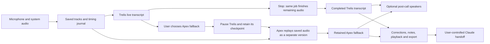

# How xx works

xx keeps audio as the source of truth and treats transcripts as editable interpretations of it. Tauri/Rust manages the desktop and capture; Next.js/React provides the interface; SQLite stores meeting metadata. Separate Python workers run local ASR and optional speakers.

## From recording to transcript

1. **Choose devices and record.** Microphone and system audio are written independently, with a session manifest and timing journal. Capture does not depend on a model loading successfully.
2. **Save before inference.** The worker builds bounded mono windows from saved audio on the session clock. Gaps and interruptions remain visible. Original tracks stay available for recovery.
3. **Follow the live transcript.** Trelis processes saved 20-second windows during the call using OpenVINO GPU FP16. It preserves the original Hindi/English script, and its raw output is retained as it arrives.
4. **Stop and finish remaining audio.** Stopping capture lets the same Trelis job drain its backlog and process the final partial window. The display changes from Live transcript to Finishing transcript, then Final transcript on completion. There is no second full pass. “Final” means processing finished, not human verification.
5. **Flag suspicious output.** Quiet input, gaps, repetition, or substantial audio with sparse text can trigger flags and bounded retries. Original results and alternatives remain available. A longer retry is not proof of better recognition.
6. **Review speakers.** Optional Community-1 runs after recording and transcription complete. Turns are mapped to transcript windows, overlapping candidates remain explicit, and manual names survive reconciliation. Live individual speaker identification remains future work.
7. **Keep notes or hand off.** Review the transcript, edit text, name speakers, add notes, and play the related audio. Trelis remains the primary version; an explicitly requested Apex fallback has its own notes and corrections. Export or hand the selected version to Claude yourself.

## Models and timing

| Profile | Execution | Output | Current role |
| --- | --- | --- | --- |
| Trelis · 20 seconds | Pinned OpenVINO GPU FP16 environment and verified stateful export | Devanagari and English | Default live transcript; same job finishes after stopping |
| Apex · 20 seconds | Pinned whisper.cpp CLI, Q5_0 conversion, Vulkan on the tested machine | Roman Hinglish | Explicit fallback in a separate version |

The adapter preserves Trelis's custom mixed-code prefix, greedy decoding, 440-token generation limit, and original script. The FP16 export retains the original tokenizer and vocabulary; no INT8 conversion or transliteration is used. The GPU is selected explicitly, and a GPU failure is visible rather than silently changing to CPU. Apex uses its documented English/transcribe decoding profile for Roman output. Exact model revisions are in [`models.json`](../stt_lab/models.json); local configurations record paths and runtime settings.

A 20-second window is a processing unit, not a guarantee that an update appears exactly 20 seconds later. Compute and queueing add delay; loading and compiling the GPU model adds startup time. Separate microphone and system tracks require separate inference requests. A call with two fully processed tracks can cost approximately twice a single-track engine run before retries or speakers are added. Segment times identify source-window boundaries, not validated word-level alignments.

The isolated acceleration experiment on an Intel Ultra 7 268V / Arc 140V laptop found:

- **23/23 chunk texts exactly matched** between CPU and OpenVINO FP16 across nine passages totalling 400.15 seconds. The six checked passages contained 816 reference words; this was development data, not a held-out accuracy test.
- **8.14× faster warm processing** on the identical 240-second subset: 281.82 seconds on CPU versus 34.62 seconds on OpenVINO. Earlier CPU requests overlapped dependency setup and were excluded from this speed comparison. Compilation, warm-up, retries, and speaker processing are excluded.
- One unreviewed, continuous ten-minute track completed in **102.48 seconds including 17.41 seconds model setup**. That clock excludes Python startup and earlier imports, and used an existing GPU cache. Encoder and decoder execution were verified on the GPU.

The integrated adapter in its independent deployment environment also matched all 23 CPU outputs exactly. A five-minute paced replay then fed two distinct saved excerpts through the actual worker and durable journal. All 30 windows completed without missing or duplicate windows, raw text remained unchanged, and the worker exited successfully about 16 seconds after input stopped. No omission retries were triggered by these excerpts. This constructed two-source test did not open microphone/system devices or run a calling application.

The replay **did not pass the strict timing gate**. First text appeared at 49.8 seconds, with 44.5 seconds spent verifying/importing/loading/compiling the model. Window-end delay was 8.5 seconds at the median and 29.8 seconds at the 95th percentile; the oldest audio in a window had a 49.8-second 95th-percentile delay. Both tracks also exceeded the test's late-delay slope threshold. This did not establish a continuously growing queue: every pair after the initial window finished before the next pair was due, and completed-window backlog repeatedly cleared. Full completion is evidence of throughput and checkpoint integrity, not a passing live-latency result. Startup and variable inference time remain visible limitations; neither a 5–15-second speech-to-display target nor 90-minute stability is qualified.

The earlier single-track warm extrapolation of roughly 12–15 minutes for a 90-minute recording, or 24–30 minutes for two fully processed tracks, remains only a planning estimate before startup, retries and speakers. The live workflow normally finishes only the remaining queued audio after stop, so a full post-call estimate does not describe its usual behavior. Speech detection skipped no windows in the engine study and is not enabled as an acceleration shortcut.

Chunk boundaries and decoding can affect omissions and repetition. Language biases, ambiguous acoustics, overlap, and recording quality can affect names, numbers, and unit words. A retry cannot reconstruct speech that was never recorded, and a glossary does not prove what was said. Flags narrow review work; they do not guarantee an error-free transcript.

## Handoff, queueing, and recovery

Only one heavy ASR or speaker worker runs at a time. Stopping capture normally leaves Trelis running until the saved audio is finished. Pausing transcription or choosing Apex fallback is a separate graceful request: the current inference must finish, its output must be saved/imported, and the process must exit before another worker takes the slot. A saved terminal checkpoint alone does not prove that model teardown is finished.

When calls happen back-to-back, capture continues even if an earlier worker is busy. Trelis starts when the slot is available and uses the saved recording, even if the call has already ended. This keeps recording independent of inference without claiming immediate live updates for every queued call.

**Use Apex fallback** is an explicit action. It is available even if Trelis failed before creating a job. Apex replays the saved recording from the beginning into a child version; it does not fill holes in or overwrite the Trelis text. Pausing a worker leaves recording intact. Trelis does not restart automatically after fallback. Pause or finish Apex, then choose Retry Trelis to resume the original Trelis job and retain its existing corrections.

Duplicate events, reloads, and recovery retain job identities instead of creating replacement transcripts. Interrupted captures need recovery before processing resumes. Existing legacy jobs keep their original settings and versions: older Apex Live Draft / Trelis Final pairs still complete their original handoff, and manual versions are not converted into the new workflow.

## Text, speakers, notes, and knowledge

Each ASR job keeps its model/configuration identity and original output. The Trelis live and completed transcript belong to the same job; completed chunks are appended without replacing recognition already saved. An Apex fallback has a different job and workspace. Corrections, notes, and speaker assignments remain version-specific with their own history. A correction made to Apex is not silently transferred to Trelis. Playback retains the related audio context.

The optional project Vault stores verified terms, names, quantities, relationships, and sources. Quantity entries require context and units. It does not currently fine-tune models, train on calls, or automatically replace words in a transcript.

There is no automatic summary stage. Copy-and-open Claude and TXT/Cowork handoff prepare content; they do not call a summary API or send a message automatically.

## Storage

| Location under the private root | Purpose |
| --- | --- |
| Meeting database | Saved meeting metadata |
| `recordings/` | Source tracks, session manifests, timing journals |
| `jobs/` | ASR windows, checkpoints, output, provenance |
| `speaker-jobs/` | Diarization jobs and results |
| `workspaces/` | Corrections, notes, speaker assignments, revisions |
| `vaults/` | Project knowledge and evidence |
| `runtime/`, `lab/` | Worker source, Python environments, models and tools |
| `runtime.json`, `speaker-runtime.json` | Local runtime configuration pointers |

`STTAPP_DATA_DIR` takes precedence over the adjacent installation pointer; otherwise the Windows local directory is used. Existing configurations contain absolute paths. Moving a populated root needs migration and validation; see [setup](SETUP.md#storage-and-backups).

## Validation boundary

Component tests, mocked browser checks, model deployment checks, and bounded native capture/integration checks serve different purposes. They do not establish a general word-error rate, perfect speaker attribution, two-hour stability, clean-machine portability, or performance on every laptop. Private call references and review artifacts are not included in this repository.
