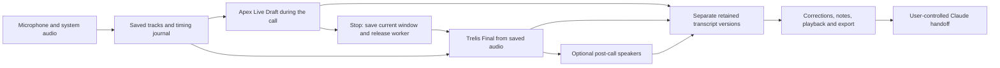

# How xx works

xx keeps audio as the source of truth and treats transcripts as editable interpretations of it. Tauri/Rust manages the desktop and capture; Next.js/React provides the interface; SQLite stores meeting metadata. Separate Python workers run local ASR and optional speakers.

## From recording to transcript

1. **Choose devices and record.** Microphone and system audio are written independently, with a session manifest and timing journal. Capture does not depend on a model loading successfully.
2. **Save before inference.** The worker builds bounded mono windows from saved audio on the session clock. Gaps and interruptions remain visible. Original tracks stay available for recovery.
3. **Follow the Live Draft.** Apex processes saved 20-second windows during the call and produces Roman Hinglish. This temporary reading aid can lag or omit content; its raw output is retained.
4. **Stop and produce the Final.** Apex finishes its current window, saves the checkpoint, and exits. After its last output is imported and the worker is free, Trelis processes the saved recording in 20-second windows. It preserves Hindi/English script. “Final” identifies this after-call pass, not human verification.
5. **Flag suspicious output.** Quiet input, gaps, repetition, or substantial audio with sparse text can trigger flags and bounded retries. Original results and alternatives remain available. A longer retry is not proof of better recognition.
6. **Review speakers.** Optional Community-1 runs after the Final completes. Turns are mapped to transcript windows, overlapping candidates remain explicit, and manual names survive reconciliation. Live individual speaker identification remains future work.
7. **Keep notes or hand off.** Review the Final, edit text, name speakers, add notes, and play the related audio. The Final is the primary version for export and manual Claude handoff; additional versions remain available.

## Models and timing

| Profile | Execution | Output | Current role |
| --- | --- | --- | --- |
| Apex · 20 seconds | Pinned whisper.cpp CLI, Q5_0 conversion, Vulkan on the tested machine | Roman Hinglish | Live Draft during the call |
| Trelis · 20 seconds | Pinned Transformers/PyTorch CPU environment, original checkpoint | Devanagari and English | Final after the call |

The adapter preserves Trelis's custom mixed-code prefix and original script. Apex uses its documented English/transcribe decoding profile for Roman output. Exact model revisions are in [`models.json`](../stt_lab/models.json); local configurations record paths and runtime settings.

A 20-second window is a processing unit, not a guarantee that an update appears exactly 20 seconds later. Compute and queueing add delay. Trelis is too slow for live use on the current CPU path. Segment times identify source-window boundaries, not validated word-level alignments.

Chunk boundaries and decoding can affect omissions and repetition. Language biases, ambiguous acoustics, overlap, and recording quality can affect names, numbers, and unit words. A retry cannot reconstruct speech that was never recorded, and a glossary does not prove what was said. Flags narrow review work; they do not guarantee an error-free transcript.

## Handoff, queueing, and recovery

Only one heavy ASR or speaker worker runs at a time. Stop is a graceful request: the current inference must finish, its output must be saved/imported, and the process must exit before the Final takes the slot. A saved terminal checkpoint alone does not prove that model teardown is finished.

When calls happen back-to-back, capture continues even if an earlier worker is busy. Eligible Finals take priority over live drafts that have not started. If a call ends before its draft starts, the draft is marked skipped instead of being backfilled; the Final still processes its saved audio. This keeps the recording independent of inference without claiming immediate live updates for every queued call.

Pausing a worker leaves recording intact. A paused or failed Final needs an explicit retry. Duplicate events, reloads, and recovery retain job identities instead of creating replacement transcripts. Interrupted captures must be finalized or recovered before the after-call pass. Existing legacy jobs keep their original settings and versions; the app does not reinterpret them as a new automatic pipeline.

## Text, speakers, notes, and knowledge

Each ASR job keeps its model/configuration identity and original output. The Live Draft is disposable in purpose, but the app retains its saved text and checkpoint for comparison. The Final has a different job and workspace; it does not overwrite the Draft. Corrections, notes, and speaker assignments remain version-specific with their own history. A correction made to Apex is not silently transferred to Trelis. Playback retains the related audio context.

The optional project Vault stores verified terms, names, quantities, relationships, and sources. Quantity entries require context and units. It does not currently fine-tune models, train on calls, or automatically replace words in a transcript.

There is no automatic summary stage. Copy-and-open Claude and TXT/Cowork handoff prepare content; they do not call a summary API or send a message automatically.

## Storage

| Location under the private root | Purpose |
| --- | --- |
| Meeting database | Saved meeting metadata |
| `recordings/` | Source tracks, session manifests, timing journals |
| `jobs/` | ASR windows, checkpoints, output, provenance |
| `speaker-jobs/` | Diarization jobs and results |
| `workspaces/` | Corrections, notes, speaker assignments, revisions |
| `vaults/` | Project knowledge and evidence |
| `runtime/`, `lab/` | Worker source, Python environments, models and tools |
| `runtime.json`, `speaker-runtime.json` | Local runtime configuration pointers |

`STTAPP_DATA_DIR` takes precedence over the adjacent installation pointer; otherwise the Windows local directory is used. Existing configurations contain absolute paths. Moving a populated root needs migration and validation; see [setup](SETUP.md#storage-and-backups).

## Validation boundary

Component tests, mocked browser checks, model deployment checks, and bounded native capture/integration checks serve different purposes. They do not establish a general word-error rate, perfect speaker attribution, two-hour stability, clean-machine portability, or performance on every laptop. Private call references and review artifacts are not included in this repository.
